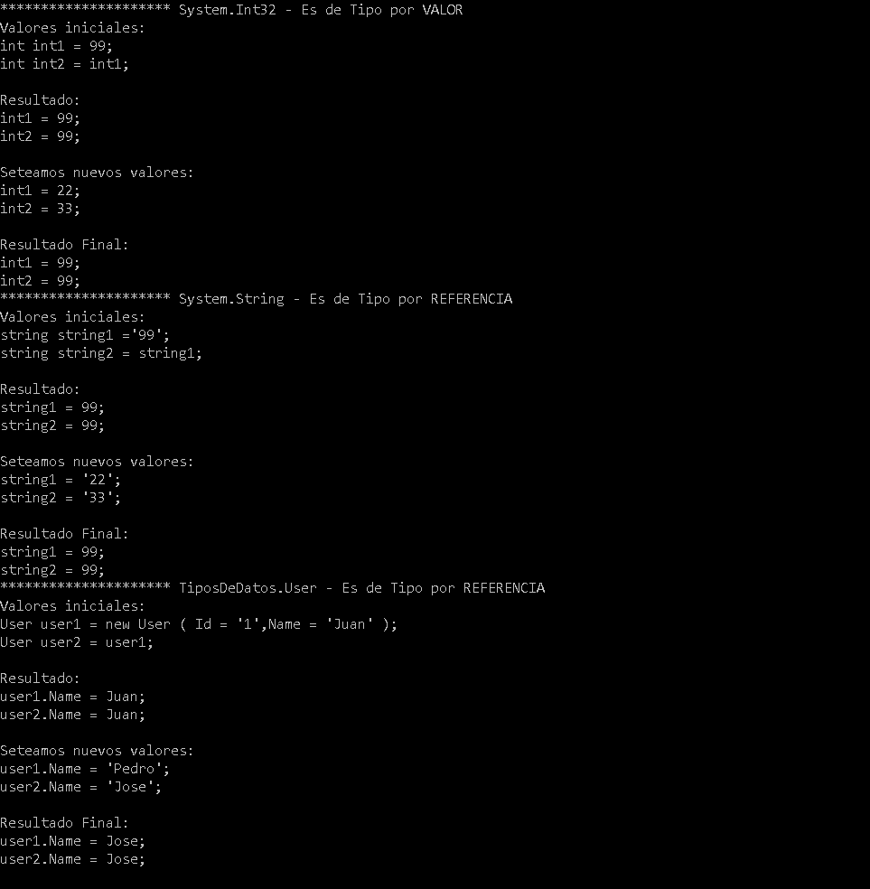

# Tipos por valor y Tipos por referencia

El objetivo es comprender la diferencia entre los tipos de datos que existen en .NET.

##Hay dos tipos de datos en .NET

***Tipos por valor:*** son tipos sencillos que almacenan directamente el valor concreto, no cambian aunque llamamos a un metodo que modifique su valor.
Con los tipos de valor, cada variable tiene su propia copia de los datos y no es posible que las operaciones en una variable afecten a la otra (excepto en el caso de las variables de parámetro ref y out).
Los tipos de valor de C# se dividen en tipos simples, tipos de enumeración, tipos de estructura y tipos de valores NULL.
https://docs.microsoft.com/es-es/dotnet/csharp/language-reference/keywords/value-types

***Tipos por referencia:*** son tipos que almacenan referencias a los datos, lo que se conoce como objetos. Con los tipos de referencia, es posible que dos variables hagan referencia al mismo objeto y que, por tanto, las operaciones en una variable afecten al objeto al que hace referencia la otra variable. 
Los tipos de referencia de C# se dividen en tipos de clase, tipos de interfaz, tipos de matriz y tipos delegados.
https://docs.microsoft.com/es-es/dotnet/csharp/language-reference/keywords/reference-types

El caso del tipo string es particular, ya que es un tipo por referencia, pero se comporta como un tipo por valor. 
Esto se debe a que .Net lo define como inmutables, es decir, una vez creado el objeto, no se puede cambiar de ninguna manera.

## Resultado
