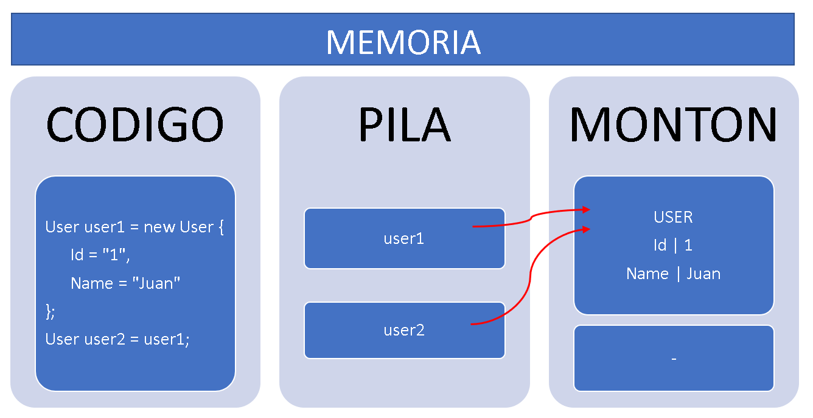
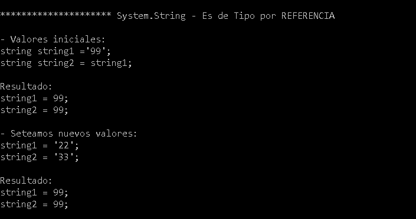
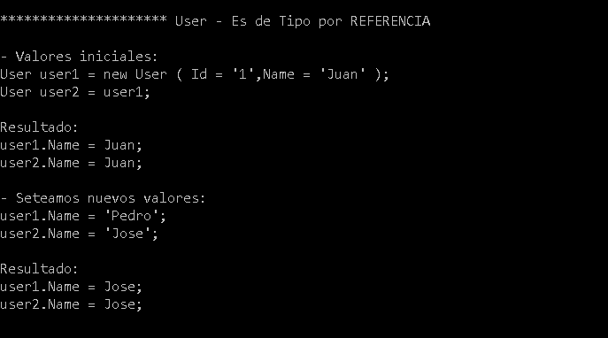

# Tipos de datos

El objetivo es comprender la diferencia entre los tipos de datos que existen en .NET.

## Informacion

### Hay dos tipos de datos en .NET

***Tipos por valor:*** son tipos sencillos que almacenan directamente el valor concreto, no cambian aunque llamamos a un metodo que modifique su valor. Con los tipos de valor, cada variable tiene su propia copia de los datos y no es posible que las operaciones en una variable afecten a la otra (excepto en el caso de las variables de parámetro ref y out). Los tipos de valor de C# se dividen en tipos simples, tipos de enumeración, tipos de estructura y tipos de valores NULL.

Estos Tipo de datos se guardan en memoria en un espacio llamado STACK o PILA: es una zona de memoria reservada para almacenar información de uso inmediato por parte del hilo de ejecución actual del programa. Por ejemplo, cuando se llama a una función se reserva un bloque en la parte superior de esta zona de memoria (de la pila) para almacenar los parámetros y demás variables de ámbito local. Cuando se llama a la siguiente función este espacio se “libera” (en el sentido de que ya no queda reservado) y puede ser utilizado por la nueva función.

https://docs.microsoft.com/es-es/dotnet/csharp/language-reference/keywords/value-types

***Tipos por referencia:*** son tipos que almacenan referencias a los datos, lo que se conoce como objetos. Con los tipos de referencia, es posible que dos variables hagan referencia al mismo objeto y que, por tanto, las operaciones en una variable afecten al objeto al que hace referencia la otra variable. 
Los tipos de referencia de C# se dividen en tipos de clase, tipos de interfaz, tipos de matriz y tipos delegados.

Estos Tipo de datos se guardan en memoria en un espacio llamado HEAP o MONTON:es una zona de memoria reservada para poder asignarla de manera dinámica. Al contrario que en la pila no existen “normas” para poder asignar o desasignar información en el montón, pudiendo almacenar y eliminar datos en cualquier momento, lo cual hace más complicada la gestión de la memoria en esta ubicación.

https://docs.microsoft.com/es-es/dotnet/csharp/language-reference/keywords/reference-types

**El caso del tipo string es particular, ya que es un tipo por referencia, pero se comporta como un tipo por valor. 
Esto se debe a que .Net lo define como inmutables, es decir, una vez creado el objeto, no se puede cambiar de ninguna manera.**

## Caso1 
Comparamos un tipo int
### Resultado

## Caso2
Comparamos un tipo string
### Resultado

## Caso3 
Comparamos un tipo User
### Resultado
